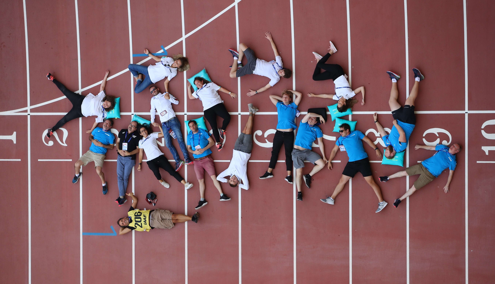
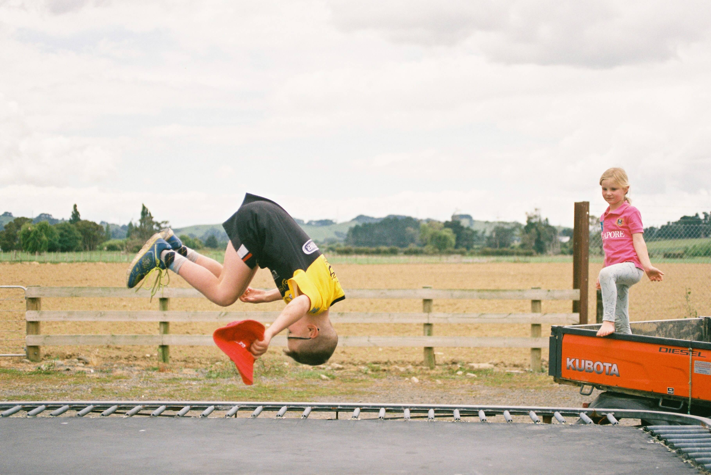
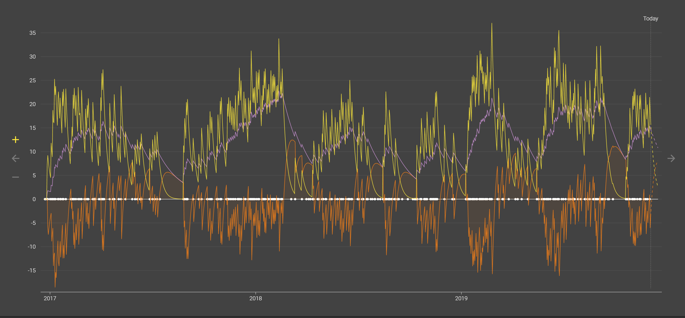
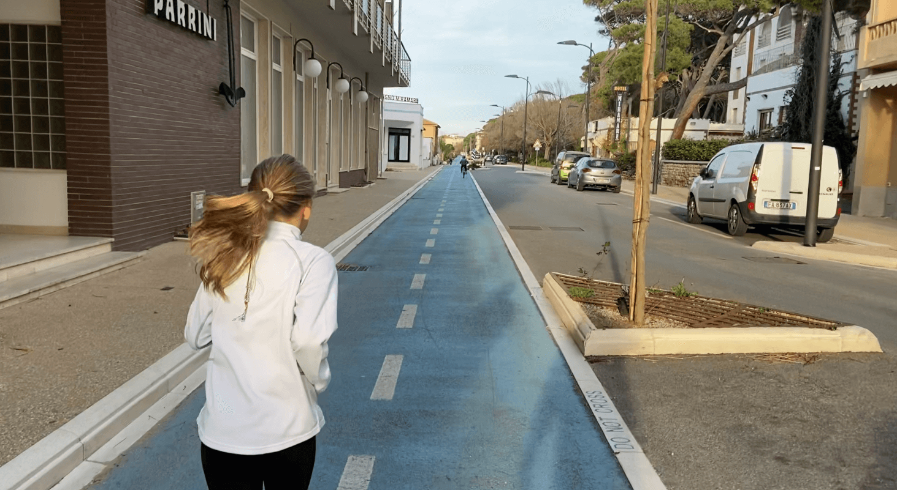

Capìta la battuta? Eh? _"Un blog sull'inevitabiltà del correre",_ quindi un post sull'-- Ok, continua a leggere, dai. Ti prometto che migliorerà.<!-- end -->

## Tu correrai con dolore

Assioma: **chi corre si infortuna**.

Non è una questione di _se_ ti infortunerai, ma di _quando_ succederà, di _quanto_ ti farai male e di _come_ reagirai a questa sosta forzata. _Se_ reagirai[^1].

La situazione, di solito, è questa: ti stai allenando ormai da un po', sei finalmente nella fase in cui il difficile non è più andare a correre ma _non_ andare a correre; ti sei abituato all'_euforia del podista_[^2], alle endorfine, al suono dei tuoi passi sull'asfalto. Magari sei lì che prepari la tua prima 10km, o addirittura una mezza maratona! O forse stai semplicemente "tirando" un po' di più del solito. E succede.

Ahia.

## Ma porc☠⚡🔪🌟💣‼

Te l'avevo detto. È inevitabile, quasi come la corsa. Fa vedere, dove ti fa male? Forse qui, all'esterno del ginocchio, un po' sopra l'articolazione? Non riesci più a salire le scale eh? Ci sono passato, è la gettonatissima [bandelletta ileotibiale](https://www.albanesi.it/corsa/running/sindrome-della-bandelletta-ileotibiale.htm). Dai, non è andata così male. Potevano capitarti il [tendine di Achille](https://www.albanesi.it/corsa/running/tendinopatia-del-tendine-di-achille.htm), la [fascite plantare](https://www.albanesi.it/corsa/running/fascite-plantare.htm), [menischi](https://www.albanesi.it/corsa/running/menisco.htm) andati, [sindrome del piriforme](https://www.albanesi.it/medicina-sportiva/sindrome-del-piriforme.htm)...

La conclusione è però sempre la stessa: _ti devi fermare_ e prendere provvedimenti. Altrimenti la situazione peggiorerà, fino a costringerti a cambiare sport. Te lo immagini essere costretto a ripiegare sul ciclismo? _Mammeglio_, piuttosto l'ippica[^3].

## Cursum desisto, ergo cogito

Non è questo il luogo adatto per approfondire le metodologie di trattamento dei varii infortuni: non sono un podista esperto né tantomeno un fisiatra e/o un medico dello sport. Quello di cui vorrei discutere è: _come sfrutti l'opportunità dell'infortunio?_ A parte imparare nuove imprecazioni, dico.

**Un imprevisto può essere trasformato in opportunità.** L'incidente che ora odii con tutto te stesso può, anzi _deve_ spingerti a riconsiderare il modo in cui ti alleni e porti avanti quella che con tutta probabilità da curiosità iniziale è diventata una _necessità_. Che non vuol dire che tu stia facendo qualcosa di sbagliato: devi solo correggere la mira, perché eventi "esterni" a parte (tipo: non hai potuto allenarti per via di un'appendicite), è evidente che qualcosa non ha funzionato come doveva.

Ad esempio, voglio raccontarti di come mi son fatto male la prima volta.

## Referto numero 1

Qui abbiamo un (non più) giovane uomo di 43 primavere, corre in maniera continuativa da circa 6 mesi ed è riuscito ad arrivare a 12km senza grossi acciacchi, a parte un dolorino insistente al ginocchio che da un po' di tempo si ripresenta fisso _(ma vedrai passerà, sìsì)_.

Ha messo circa 400km nelle scarpe, quindi magari è il caso di comprarle nuove (e anche se non è il caso ne ha voglia). Le compra, scegliendole completamente diverse da quelle usate fino ad allora --ché se si cambia lo si fa per bene o per niente: passa pertanto da un paio di Asics Gel Cumulus 18 _(per pronatori, drop 10mm)_ a delle Hoka One One Bondi 5 _(neutrali, drop 4mm)_. Il novello [Gelindo Bordin](https://it.wikipedia.org/wiki/Gelindo_Bordin) ha inoltre letto da poco un libro sulla tecnica di corsa, dove si consiglia _ai podisti avanzati_ l'uso di un _metronomo_ durante l'allenamento per raggiungere il ritmo ottimale di 180 passi al minuto.

Quindi, vediamo cosa manca alla ricetta dello chef per farsi male in maniera sicura e spettacolare:

- ignorare i messaggi del proprio corpo (ginocchio).
- scarpe nuove mai usate prima.
- stravolgimento improvviso delle dinamiche di corsa (metronomo).

Uhmmm... Ah, già! Che sbadato! Corro agevolmente 8-10km e recentemente sono arrivato a 12? Bene:

- passare da 12 a 15km tutto di un colpo!

Il risultato? Mr. _"43 primavere e non capire una mazza"_ dopo 15km di esaltazione arriva a casa con la lingua penzoloni e il ginocchio che URLA. Nei giorni successivi riuscirà a malapena a camminare ed avrà così tutto il tempo di familiarizzare con la famigerata _bandelletta ileotibiale_, una bastardissima fitta acuta all'esterno del ginocchio che si dimostrerà indifferente ad antinfiammatori, ghiaccio, preghiere e bestemmie.

## Come ho reagito?

Inizialmente, male. Appena il ginocchio ha iniziato a calmarsi ho riprovato subito a correrci sopra, col risultato di infiammarlo ancora di più. Il risultato finale è stato uno stop forzato di quasi 3 mesi. Dopo il primo mese per fortuna la voglia di tornare a correre era talmente intensa che ho iniziato ad andare in palestra, dove un istruttore molto preparato ha analizzato il mio problema, mi ha spiegato che dipendeva da una serie di difetti posturali che erano stati esacerbati dalla combinazione _"scarpe nuove + distanza eccessiva + ritmo di corsa innaturale"_ ed abbiamo iniziato a lavorare assieme per migliorarli.[^4]

## Cosa ho imparato?

Dopo un po' ho dovuto smettere di frequentare la palestra per mancanza di tempo, tuttavia le nozioni apprese sono rimaste. Ora so che si deve procedere per **graduali incrementi di difficoltà e distanza** e riesco a **capire molto meglio i segnali di allarme che mi manda il corpo**: anche senza sapere cosa è una bandelletta ileotibiale, un dolore persistente a un'articolazione, non dovuto a un incidente, _deve_ metterti in allarme e spingerti a prendere provvedimenti.

Questa prima convalescenza è stata anche l'occasione per realizzare che **la corsa ha definitivamente cambiato il modo in cui affronto gli ostacoli**: io che ero abituato a mollare al primo disagio (sai quante volte prima di allora avevo iniziato ad andare in palestra e smesso per un raffreddore o una semplice giornata storta?), mi sono ritrovato a lavorare attivamente per tornare a "faticare" il prima possibile.

Mi sono fermato molte altre volte da allora, non sempre a causa di infortuni: nel grafico qua sotto, dove la linea gialla rappresenta la quantità di allenamento al passare del tempo, una delle "buche" corrisponde ai due mesi passati in Ungheria per adottare i miei figli. Un'altra è dovuta alla rimozione di un neo pericoloso, con conseguente divieto del dermatologo di "correrci sopra" impedendo una corretta guarigione della cicatrice.

Insomma, è tutto un cadere e rialzarsi, più o meno metaforicamente. Di sicuro non posso pretendere la "resistenza all'usura" di un ventenne: ho 45 anni, 20 anni di lavoro al computer mi hanno forgiato storto e rigido, ma _gli ultimi 3 anni di sport mi hanno letteralmente salvato la vita:_ la corsa mi ha dato e mi darà moltissimo, in termini di salute fisica e mentale.

## La scena dopo i crediti finali

L'altra mattina io e mia figlia (10 anni) abbiamo corso per la prima volta insieme. _"Vai piano amore, altrimenti finisci subito tutte le energie, ricorda che quello che corriamo all'andata lo dobbiamo fare anche al ritorno"_. Lei ha annuito e si è fatta i primi 3km sotto i 6 min/km apparentemente senza sforzo, per poi fermarsi di colpo e _"ora sono stanca, torniamo camminando"_. Il tutto mentre suo fratello di 8 anni sfrecciava avanti e indietro in bicicletta e ci prendeva in giro.

Ma io vi ci riporto, sì, in Ungheria. E poi vi riporto indietro. _A corsa_.

[^1]: ma quanto mi garberanno i corsivi, eh? Incredibile.
[^2]: meglio conosciuta come [runner's high](https://it.wikipedia.org/wiki/Endorfine#Runner's_high), ma io sono un autarchico.
[^3]: si ruzza, eh? _"Io ho tantissimi amici ciclisti, e li rispetto molto."_
[^4]: esercizi di potenziamento del _core_, dei muscoli della coscia e dei glutei e stretching, tanto.
