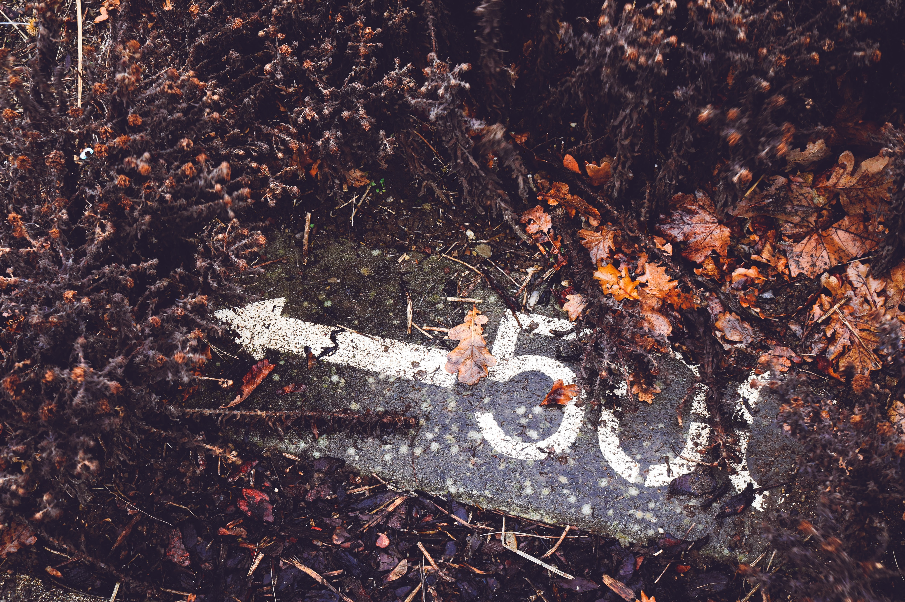
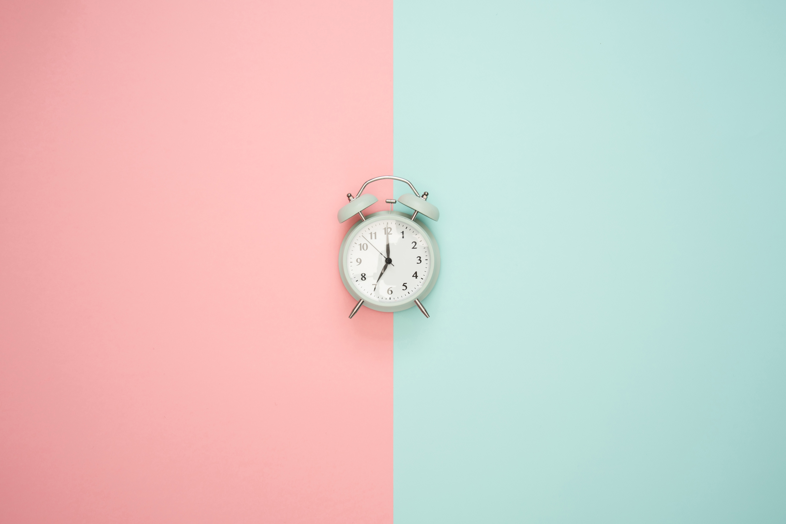
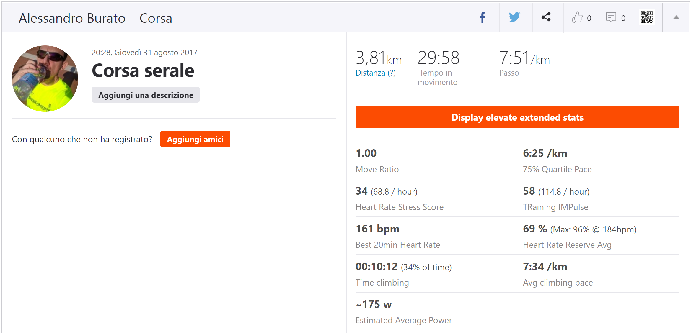

## Prima si cammina

Come accennato nel [post precedente](/2019/le-basi-come), per i primi 3 mesi non ci penso neanche, a correre. Cammino (direi "marcio" se la marcia non fosse una [disciplina seria](<https://it.wikipedia.org/wiki/Marcia_(atletica_leggera)>)), a un ritmo che --per capirsi-- è quello di quando stai perdendo il treno e ti affretti verso la stazione, ma per non perdere anche la dignità non permetti ai tuoi piedi di staccarsi da terra contemporaneamente[^1]. Di solito queste camminate si svolgono sulla spiaggia, più raramente sull'asfalto.<!-- end -->

Inizialmente registro ogni camminata direttamente con [Strava](https://www.strava.com), utilizzando il GPS del cellulare. Torno spesso al primo amore, Torre Mozza, passando sia dalla strada che dalla spiaggia; fare sempre gli stessi percorsi mi permette di confrontare le mie prestazioni al passare del tempo, di _misurare_ la mia evoluzione: piano piano vedo i tempi migliorare, i muscoli iniziano a rispondere meglio e a recuperare più in fretta. Scopro dolori di cui non sospettavo l'esistenza, che però passano in fretta lasciandomi stanco, indolenzito e soddisfatto.

## Una regola

So di essere una persona poco costante, per questo fin da subito mi do una semplice regola --**"non un metro di meno, non un minuto fermo"**: prima di uscire a camminare decido quanti km voglio fare quel giorno **e li faccio**, sempre, senza eccezioni, senza fermarmi. Anche se inizia a piovere, anche se incontro degli amici, anche se mi fa male qualcosa; se mancano 100 metri alla distanza stabilita, ne percorro 200, _mai_ 99.

Una semplicissima regola, _che ad oggi non ho mai infranto_, spazza via anni di circoli viziosi e dà vita a un **circolo virtuoso**: _"se l'ultima volta ce l'ho fatta, ce la farò anche oggi. Se mollo, mollerò anche domani"_.

Non è facile mantenere l'impegno: tutti i motivi sembrano buoni per smettere in anticipo, nella testa una battaglia continua di _"dai, smetti, oggi hai dato, domani farai di più"_ _"no."_ _"dai, fermati un attimo, poi riparti"_ _"no."_ --e così via. Un battibecco snervante, ma con il tempo, come un bambino bizzoso che ha capito che non otterrà quello che vuole, le proteste si affievoliscono, diventano sempre più rade, fino quasi a sparire. Oggi, quando il "moccioso interiore" si azzarda a proporre un timido _"certo, oggi fa caldo eh?"_ riceve come risposta un'occhiataccia (interiore), e si cheta all'istante. Soddisfazioni genitoriali.

## Poi...

**Poi la camminata non mi basta più**. Raggiunto un certo passo, camminare diventa inefficiente e si fatica meno ed ottiene di più correndo. Sono ancora troppo grasso, ma a quello ci penserò con calma: _è giunto il momento di fare il passo più lungo della gamba._

Inizio a spulciare i siti dedicati alla corsa, cercando un programma che mi permetta di iniziare gradevolmente senza farmi male. Lo trovo: è piuttosto famoso, si chiama [Couch to 5k](https://www.c25k.com/c25k_italian.htm) (C25K): in pratica ogni settimana si fanno circa 3 allenamenti di 30-40 minuti ciascuno, all'interno dei quali si alternano camminata e corsa. Mano a mano che passano le settimane, il tempo dedicato alla camminata viene ridotto ed aumentato quello per la corsa, fino a correre ininterrottamente per la durata intera dell'allenamento salvo un breve riscaldamento iniziale.

Ci sono anche diverse app dedicate al C25K, che ti permettono di farti guidare dal cellulare senza dover guardare l'orologio. Scelgo la più popolare e inizio.

## pochi secondi di corsa sono un'eternità

...se non sei abituato. Ti manca proprio il fiato, respiri male, il cuore ti batte fortissimo. Correre in questa fase non è un piacere, è una tortura: la seconda settimana ad esempio prevede 90 secondi alternati a 60 di camminata. Inferno-paradiso-inferno-paradiso etc.

A volte "ripeto" la settimana corrente, perché non mi sento pronto ad aumentare la corsa. Ci sono settimane in cui non corro, perché non ho tempo, perché non ho voglia. Faccio davvero molta fatica. Il problema è sempre lo stesso: _peso ancora troppo_ --grazie agli allenamenti e a una dieta più morigerata sono riuscito a scendere da 104 a 100kg, ma sono sempre circa 20kg di troppo per la mia costituzione.

## il tiro della cinghia

La mia voglia di correre è per fortuna abbastanza potente da far sì che mi rivolga a una **nutrizionista**, peraltro molto brava. Grazie a un piano alimentare ben congegnato e al mantenimento dell'attività sportiva, riesco a dimagrire in maniera graduale e costante.

Finalmente arrivo a correre mezz'ora di fila, per quanto a un passo decisamente scarso (quasi 8 min per fare 1km). È una conquista incredibile.

Da lì in poi non ho più smesso di correre, salvo cause di forza maggiore come infortuni, operazioni etc. Mi sono comprato un orologio da corsa decente, scarpe e abbigliamento appropriati e ho iniziato ad allenarmi basandomi sul battito cardiaco.

Ma di questo parleremo la prossima volta.

[^1]: La differenza tra _corsa_ e _camminata_ è che nella seconda _almeno un piede_ rimane sempre a contatto con il terreno.
