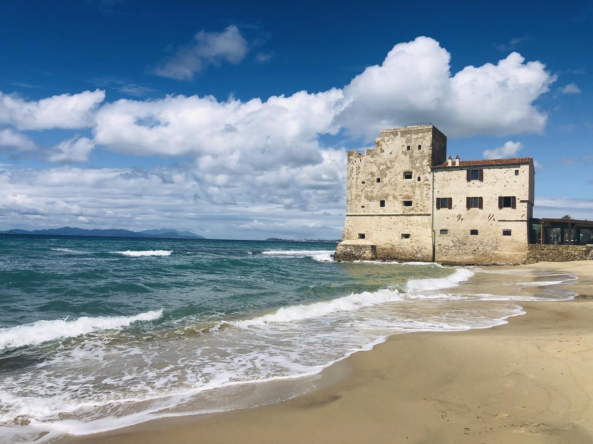
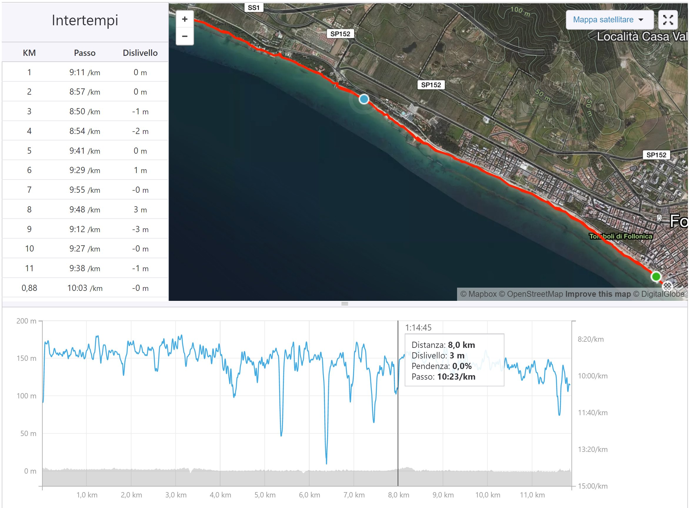

## "Come hai iniziato a correre?"

Iniziamo dal _quando_, arriveremo poi al _come_. E al _perché_.

È la vigilia di Natale del 2016, una giornata splendida, piena di sole. Abito in riva al mare, letteralmente, il tempo e il luogo perfetti per uscire. Infatti sono saldamente piazzato sul divano, davanti alla [PS3](https://it.wikipedia.org/wiki/PlayStation_3).<!-- end -->

Peso **102kg x 172cm**, ho alle spalle un numero imprecisato di tessere della palestra appena scalfite e diete fallite con gli interessi.

Il programma è finire [God Of War](https://it.wikipedia.org/wiki/God_of_War:_Ascension) una volta per tutte: non avrò i muscoli e l'agilità di [Kratos](<https://it.wikipedia.org/wiki/Kratos_(God_of_War)>), ma ho un joypad per controllarlo e un numero a piacere di potenziali fallimenti, senza che le conseguenze debbano essere più gravi di un "riparti dall'ultimo salvataggio".

Son pronto: la gioja è tale che prendo in mano il cellulare e, su Facebook, lo annuncio in pompa magna: _"il vs. avrà la meglio su mitici mostri di pixel mitologici, in una bella maratona di Playstation, AH BENE!"_

**_"Bravo coglione!"_** --mi risponde uno dei miei contatti. **_"Con una giornata così, invece di goderti l'aria e il mare... Va a farti una passeggiata, BRODO [^1] --te la meriti proprio la Pleistescion"_** (sic).

Ecco, non ho ancora iniziato a giocare e già mi han fatto un culo considerevole.

A questo punto ho due scelte: me ne frego e premo _start_, oppure...

Per fortuna scelgo _"oppure"_: _"oppure mi vesto e vado a passeggiare sulla spiaggia"_, per la precisione-- un'epifania alla vigilia. Grazie Gesù che domani nasci, grazie _(obtorto collo)_ contatto di FB scortese ma sincero _(che magari domani muori, era molto obtorto il collo, eh)_. Grazie, ci son rimasto malino, però...

## Però vado

La pioggia caduta pochi giorni prima aveva reso il manto sabbioso compatto e facile da percorrere. Mi ero messo una vecchia tuta da ginnastica e un paio di scarpe da Trekking vecchie di 10 anni almeno. Calzini di spugna e a completare il tutto un k-way grinzoso ma brutto.

Decisi di registrare quella prima camminata con Strava, un' app per cellulare che sapevo essere usata dagli "sportivi", tanto per avere un ricordo dell' ennesimo tentativo fallito di mettermi un po' in riga.

Successe una cosa strana. Marciavo a un ritmo abbastanza sostenuto, non certo una camminata rilassante. Eppure dopo 2, 3, addirittura 4 km, qualcosa in me per la prima volta in 40 anni chiedeva di andare un po' più avanti, di spingermi un po' più in là. Si intravedeva, in lontananza, quel posto meraviglioso che è Torre Mozza, ma figurati se sarei riuscito ad arrivarci! Nah, Torre Mozza è fuori portata, piedi per terra, dai.

## Però magari

...Però magari faccio un'altra po' di strada. Arrivo fino a quello scoglio. Vabbè, scoglio raggiunto, già che ci sono posso arrivare al Club Nautico, è già una bella soddisfazione, dai (occhio, poi devi tornare indietro eh?). Bon, arrivato anche al Club. Bella roba. Pensa te, ho fatto 4km, in tutto saranno 8, mica male. Certo, Torre Mozza è davvero vicina, ora. Oddio, vicina, sembra vicina, ma magari poi mi prende un colpo e crollo, poi non ce la faccio a tornare, no dai. No.

## Sì, dai. Sì.

Dovetti anche attraversare una zona in cui la spiaggia era completamente stata erosa, aggrappandomi a un muretto e due scogli sporgenti. Ma arrivai a Torre Mozza. Stanco, ma non sfinito.

Volli toccare la torre in un gesto a metà tra lo scaramantico e il pionieristico, e tornai subito indietro. Saranno state le endorfine, non lo so, ma feci i 6km del ritorno a cuor leggero, sempre cercando la marcia serrata, non volevo che si trasformasse in una "passeggiata".

Così, tra l lusco e il brusco, completai il mio primo **_allenamento_** propriamente detto.

[^1]: _Brodo:_ termine maremmano atto a indicare persona di scarsa intelligenza e/o valore. Come _bischero_, ma peggio.
