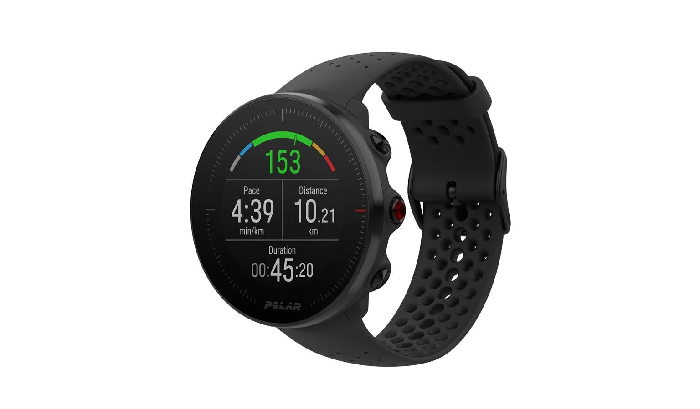

Nel caso a qualcuno interessasse, questi sono gli strumenti che utilizzo per accompagnarmi nella corsa.

## L'orologio

Sono da sempre un affezionato utente di Polar. Trovo che a differenza del gigante Garmin, l'azienda Finlandese riesca sempre a creare prodotti essenziali, senza riempirli di gadget e funzionalità che poco hanno a che fare con lo sport e l'allenamento e molto con "moda" del momento (musica, pagamenti etc).

Ho iniziato con il glorioso M400, sono passato a [M430](https://amzn.to/36UAByD), che rappresenta ancora oggi un'ottima scelta per chi cerca affidabilità a un prezzo ridicolo (senza preoccuparsi del look datato) e mi sono recentemente aggiornato al [Vantage M](https://amzn.to/2Z9ptva), che mi sta dando grandi soddisfazioni e non mi costringe a nasconderlo nell'uso quotidiano, perché anche l'occhio vuole la sua parte.
