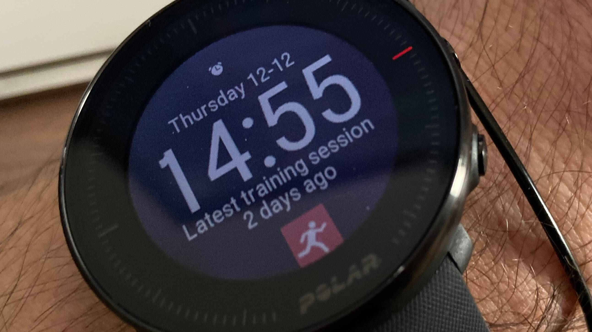
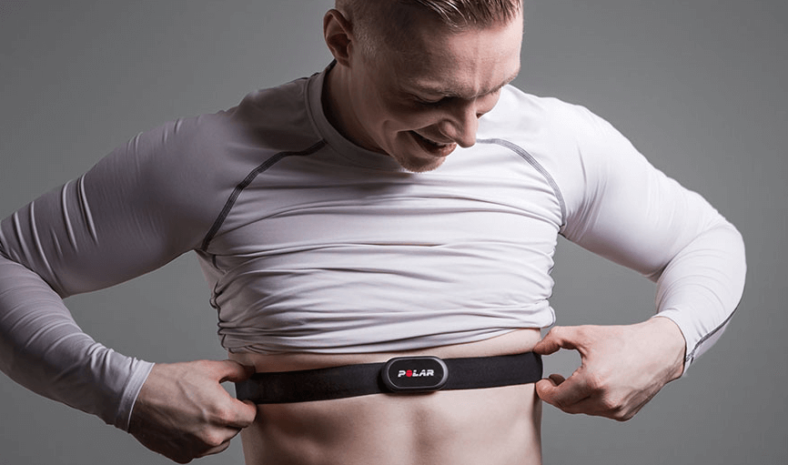
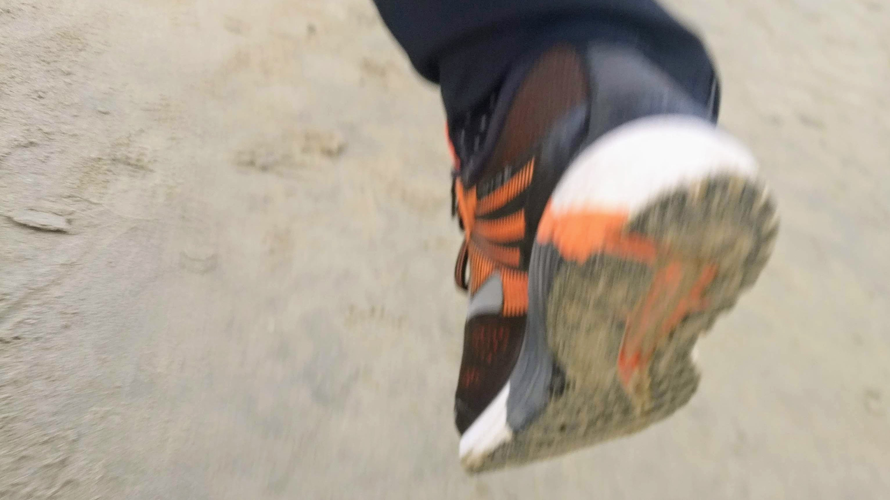
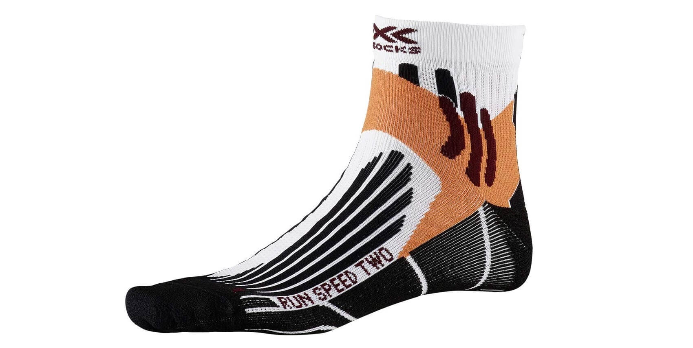

# Gli attrezzi del mestiere

Nel caso ti interessasse, questi sono gli strumenti che utilizzo per accompagnarmi nella corsa. _Caveat emptor[^1]:_ i link portano all'affiliazione di Amazon perché due eventuali spiccioli di commissione non guastano e a te non costa nulla. Detto questo, **_io non faccio marchette_**: qui troverai solo i pochi oggetti che utilizzo regolarmente durante i miei allenamenti, acquistati con i miei soldi e non _"in prova"_.

## Orologio: Polar Vantage M

Sono da sempre un affezionato utente di Polar. Trovo che a differenza del gigante Garmin, l'azienda Finlandese riesca sempre a creare prodotti essenziali, senza riempirli di gadget e funzionalità che poco hanno a che fare con lo sport e l'allenamento e molto con "moda" del momento (musica, pagamenti etc). Inoltre, la piattaforma online [Polar Flow](https://www.polar.com/it) non ha eguali per qualità di programmi di allenamento e analisi dei dati raccolti.

Ho iniziato con il glorioso M400, ormai fuori produzione, sono passato a [M430](https://amzn.to/36UAByD), che rappresenta ancora un'ottima scelta per chi cerca affidabilità a un prezzo ridicolo e mi sono recentemente aggiornato al [Vantage M](https://amzn.to/2Z9ptva), che mi sta dando grandi soddisfazioni e non mi costringe a nasconderlo nell'uso quotidiano --perché anche l'occhio vuole la sua parte e diciamocelo, il modello M430 è brutto come il peccato.

## Fascia cardio: Polar H10

Un allenamento serio presuppone un controllo costante e preciso del battito cardiaco, soprattutto quando si iniziano a fare sessioni ad alta intensità (intervalli e ripetute). Per quanto i sensori si siano evoluti negli ultimi anni, **_la lettura del battito cardiaco dal polso o comunque tramite sensore ottico NON è MAI affidabile_**. Non importa se hai l'ultimo sportwatch in titanio da 1200 euro: il suo povero sensore ha l'ingrato compito di capire quanto velocemente ti batta il cuore "osservando" il flusso sanguigno sotto la pelle del polso, disturbato da peluria, movimento, sudore, colore della pelle, disposizione delle vene etc. Nel migliore dei casi riuscirà a restituirti una passabile approssimazione del battito _medio_ alla fine della corsa, tanto meno imprecisa quanto minori sono stati intensità e variazioni di ritmo --insomma, _funzionerà (maluccio) solo quando non ne avrai bisogno_.

Una **_fascia cardio corrisponde invece a una monoderivazione di ECG_**, ed è l'unico modo che avrai per conoscere la tua frequenza cardiaca istantanea con ritardi e imprecisioni trascurabili. Ancora una volta la scelta ricade su **Polar**, che le fasce cardio le ha inventate. La [Polar H10](https://amzn.to/2tKNNrB) non ha sensori di movimento o altri ammenicoli: fa UNA cosa, alla perfezione, è capace di registrare la sessione senza che tu ti debba portare orologio o smartphone dietro ed è anche molto molto comoda. Tra l'altro questi sensori sono ormai universali: puoi usare fascia cardio Polar e orologio Garmin o Suunto, e viceversa.

## Scarpe: Brooks Adrenaline GTS 18

A differenza di orologio e fascia, non posso consigliarvi un paio di scarpe a priori: devono essere una scelta personale e ponderata. Io ho sempre preso calzature adatte a un corridore pesante e pronatore, iniziando con _Asics_ per proseguire con _Hoka_, _Under Armour_, _Reebok_, _Nike_ e infine _[Brooks](https://amzn.to/2PR8iLZ)_.

Queste sono quelle su cui ho messo gli ultimi 600km di corsa e che mi sono piaciute di più in assoluto: comodissime, bilanciate, anche lievemente reattive, molto ma molto resistenti --sono ancora praticamente nuove e sebbene il kilometraggio mi imporrà a breve di sostituirle, continuerò a portarle come scarpe da passeggio.

## Calze: X-Socks/Gore Running Wear

[Un paio di calze 15 euro?](https://amzn.to/2Fahhlc) Eh sì. E le valgono tutte. Primo perché sono indistruttibili, secondo perché ti coccoleranno il piede, terzo perché puoi comprarne anche solo due paia e andarci avanti 2 anni lavando un paio e indossando l'altro. Nella mia esperienza, sono sempre morbide come la prima volta, anche se iniziano a mostrare i primi segni di consumo. Ho provato anche modelli equivalenti di Asics ma non c'è paragone, dopo pochi lavaggi sono diventate ruvide come i peggio calzini del discount. Altra ottima scelta sono i prodotti di [Gore Running Wear](https://amzn.to/2SKSBrt), sempre sullo stesso prezzo.

Rispetto a un paio di calze non specifiche riducono enormemente la possibilità di vesciche e bruciature da sfregamento, fanno respirare il piede di estate e lo tengono al caldo di inverno. Certo, se poi infili il piede in un paio di scarpe sbagliate, è tutto inutile: sono calze, non reliquie miracolose.

## E il resto?

Per ora mi fermo qua: direi che ho coperto i fondamentali. Come ho già scritto in un post apposito, è sufficiente acquistare abbigliamento sportivo, possibilmente aderente, e coprirsi a strati a seconda delle temperature e del clima. Nel dubbio, **_vestiti leggero/a_**, ti scalderai durante la corsa.

Su Amazon un ottimo compromesso tra qualità e prezzo è rappresentato dalla marca [Ultrasport](https://amzn.to/2MRrRlk), dacci un'occhiata.

[^1]: Oioia, questo [_latinorum_](https://it.wikipedia.org/wiki/Caveat_emptor), che fissa.
